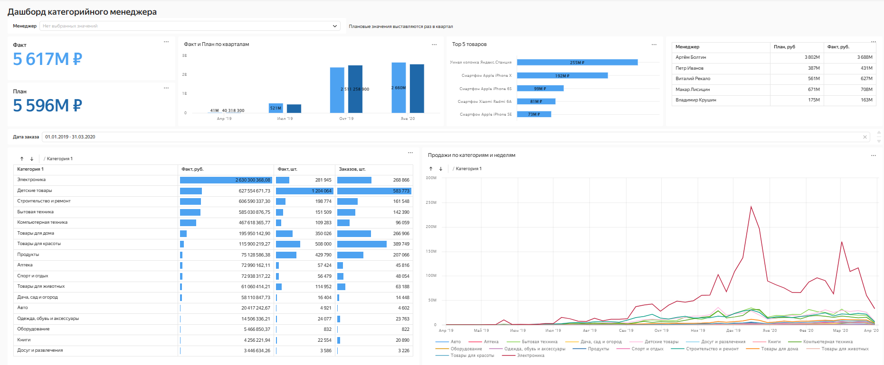
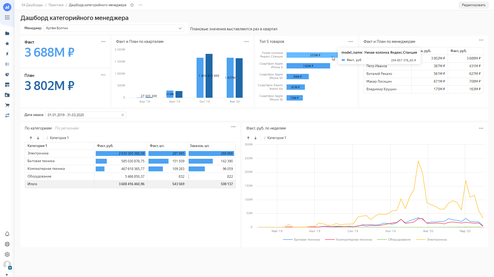
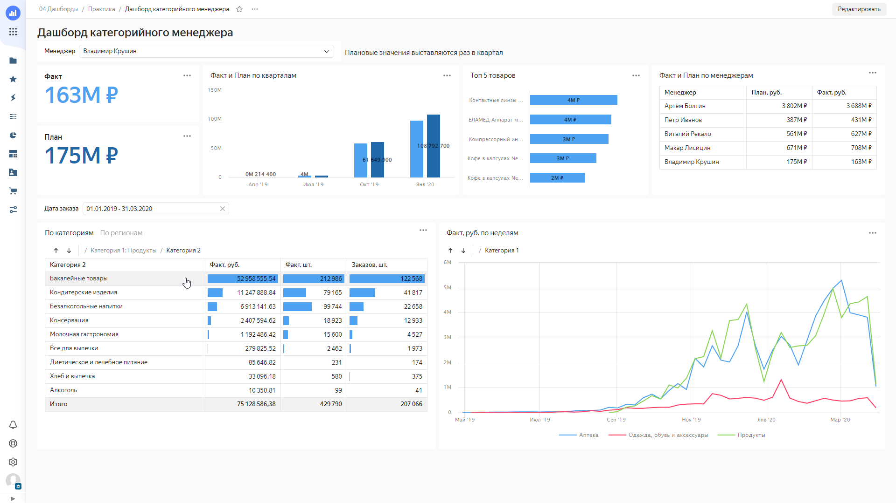
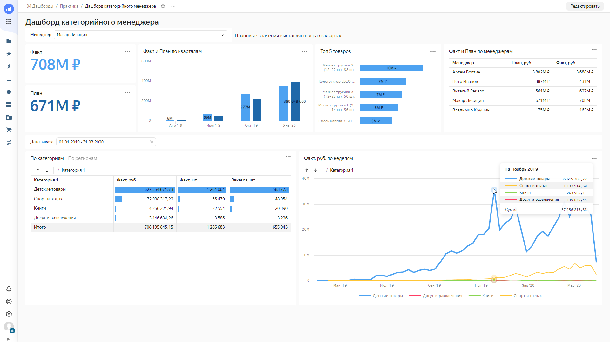
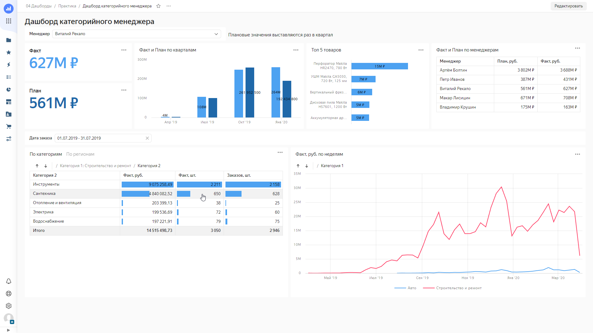
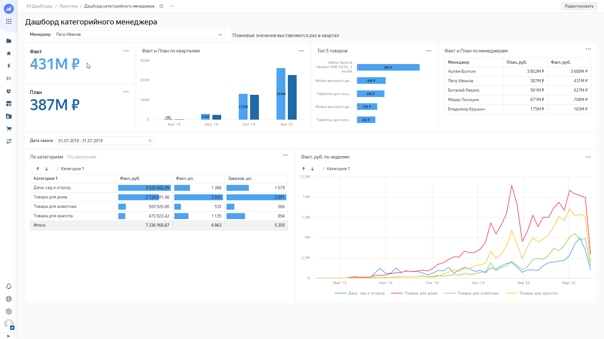

# 📈 Category Manager Dashboard

**Interactive dashboard in Yandex DataLens** for analyzing sales by managers, products, and categories.

## 🧠 Project Description
This project addresses real business needs in category management:
- Analyzing sales plan fulfillment
- Identifying best-selling products
- Comparing categories by revenue and number of orders
- Tracking seasonal peaks and sales trends by week

All data is visualized for quick interpretation and decision-making.

## 🔍 Business Questions Answered
- What is the best-selling product by revenue for a specific manager?
- Which level-2 category in "Groceries" has the highest sales?
- In which week did "Children's Goods" reach peak sales?
- How many units were sold in the "Plumbing" subcategory during a specific period?
- What is the total revenue generated by a specific manager?

## 📊 Dashboard Preview

[Open in DataLens](https://datalens.yandex.cloud/s1vfz4takng8e?_no_controls=1&_lang=en)

The dashboard includes:
- Plan vs. actual sales by quarter
- Top 5 products by total sales
- Sales by first-level category
- Weekly sales dynamics
- Filters by manager and order date

## 🛠 Technologies Used
- **Yandex DataLens** — data visualization and dashboard creation

## 📋 Business Questions: Answers and Screenshots

The dashboard answers the following business questions:

1. **Best-selling product by Artem Boltin**  
   _Answer:_ Yandex.Station Smart Speaker (₽255M)
   
   

2. **Top level-2 category in "Groceries" by Vladimir Krushin**  
   _Answer:_ Groceries goods
   
   

3. **What week did Makar Lisitsin have the highest sales in category 1 “Children's Products”?**  
    _Answer:_ from November 18, 2019
   
    

4. **How many units of goods in the category "Construction and Repair" → "Plumber" was sold by Vitaliy Rekalo from July 1 to July 31, 2019?**  
    _Answer:_ 650 units
   
    

5. **How many rubles did the actual sales of all categories of Peter Ivanov amounted to?**  
    _Answer:_ 431 million rubles
   
    

## ✨ Outcomes
- The dashboard provides instant answers to key sales questions.
- Easy comparison of actual sales against targets.
- Quick identification of growth points and assortment optimization opportunities.

---

**P.S.**  
The dashboard is designed with a focus on category managers: minimal clicks — maximum insights. 🎯
