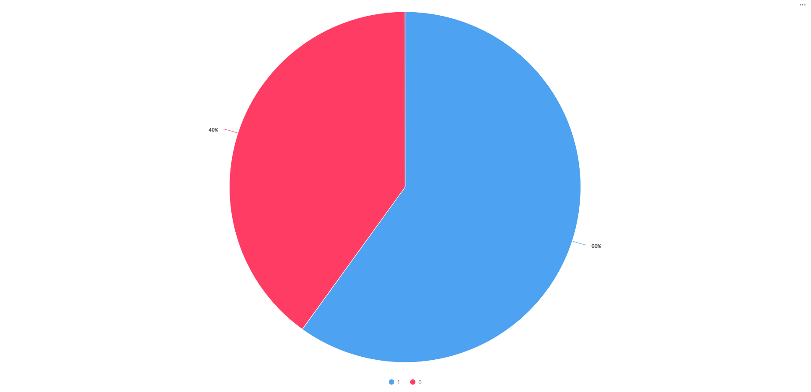

## Task :bar_chart:
- Determine which product will be most profitable to launch in your own production by the New Year holidays
- Explore delivery during the New Year holidays

&#128269 **Key Questions:**
- When do seasonal product sales peak throughout the year?
- At what point do consumers begin shopping for New Year’s goods?
- Which New Year-related products sell the most?
- How does delivery performance change during the holiday period?
- Which order had the longest delivery time, and why?

**1. How seasonal goods are sold during the year?**

[Open in DataLens](https://datalens.yandex.cloud/preview/y7llit3y38g4k?_lang=en)

**Сonclusion:** The diagram doesn't show the anticipated peak sales before the holidays. Something's wrong with the data.

**2. Check what percentage of the “New Year products” category goods belongs to seasonal goods**

[Open in DataLens](https://datalens.yandex.cloud/preview/mv9atxn1ts0c8?_lang=en)

**Сonclusion:** 40% of the goods in the New Year's category are non-seasonal goods. The flag cannot be used for further research.

**3. What time do people start preparing for the New Year and doing their shopping?**

[Open in DataLens](https://datalens.yandex.cloud/preview/fo26au5ispti1?_lang=en)

**Сonclusion:** The growth and peaks of purchases of goods from the New Year 's goods category fall between November 18 and December 16.

**4. Which product is best sold among New Year's goods?**

[Open in DataLens](https://datalens.yandex.cloud/preview/lu8e48ms10927)

**Сonclusion:** To be released, it is necessary to recommend the product of Гирлянда Sh Lights Шарики цветные OLDBL100, 15 м, 100 ламп.

**5. Are deliveries longer than a week associated with longer distances between the ordering city and the delivery city?**

[Open in DataLens](https://datalens.yandex.cloud/preview/mv9ww3ilc41c8?_lang=en)

**Сonclusion:** Long-distance deliveries are part of the delivery service.

**6. What's the most problematic and longest delivery service?**

[Open in DataLens](https://datalens.yandex.cloud/preview/1aptnt4cpjrqn?_lang=en)

**Сonclusion:** Taxi delivery is the longest delivery.

